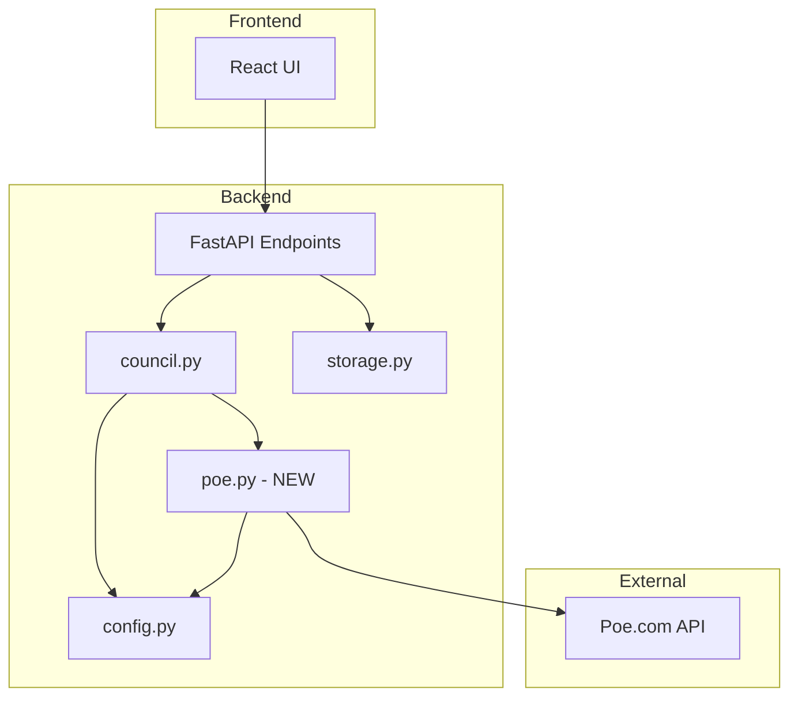

# Design Document: Poe.com API Migration

## Overview

This design document describes the migration of the LLM Council application from OpenRouter API to Poe.com's official API. The migration replaces the `backend/openrouter.py` module with a new `backend/poe.py` module that uses the `fastapi-poe` library, while maintaining backward compatibility with the existing frontend and API structure.

The key changes are:
1. Replace OpenRouter authentication (API key) with Poe authentication (API key from poe.com/api_key)
2. Replace OpenRouter's REST API calls with fastapi-poe's `get_bot_response` function
3. Update model identifiers from OpenRouter format to Poe display names
4. Maintain identical API responses and SSE event structure for frontend compatibility

## Architecture



### Data Flow

1. User sends query via frontend
2. FastAPI endpoint receives request
3. `council.py` orchestrates the 3-stage process
4. `poe.py` handles all Poe.com API communication
5. Responses flow back through the same path
6. Frontend receives identical JSON/SSE format as before

## Components and Interfaces

### 1. Configuration Module (`backend/config.py`)

Updates to support Poe.com:

```python
# Environment variable
POE_API_KEY = os.getenv("POE_API_KEY")

# Council members - Poe display names
COUNCIL_MODELS = [
    "GPT-5",
    "Claude-Sonnet-4.5", 
    "Gemini-2.5-Pro",
    "Grok-4",
]

# Chairman model
CHAIRMAN_MODEL = "Gemini-2.5-Pro"

# Title generation model (fast/cheap)
TITLE_MODEL = "GPT-4o-Mini"
```

### 2. Poe API Client (`backend/poe.py`)

New module replacing `openrouter.py`:

```python
async def query_model(
    bot_name: str,
    messages: List[Dict[str, str]],
    api_key: str
) -> Optional[Dict[str, Any]]:
    """Query a single Poe bot and return accumulated response."""

async def query_models_parallel(
    bot_names: List[str],
    messages: List[Dict[str, str]],
    api_key: str
) -> Dict[str, Optional[Dict[str, Any]]]:
    """Query multiple Poe bots in parallel."""
```

### 3. Council Module (`backend/council.py`)

Minimal changes - update imports from `openrouter` to `poe`:

```python
from .poe import query_models_parallel, query_model
```

### 4. Main API (`backend/main.py`)

No changes required - maintains same endpoints and response format.

## Data Models

### ProtocolMessage (fastapi-poe)

Input message format for Poe API:

```python
@dataclass
class ProtocolMessage:
    role: str  # "user", "assistant", or "system"
    content: str
    attachments: List[Attachment] = field(default_factory=list)
```

### PartialResponse (fastapi-poe)

Streaming response chunk from Poe API:

```python
@dataclass
class PartialResponse:
    text: str  # Accumulated text so far
    is_suggested_reply: bool = False
    is_replace_response: bool = False
```

### Internal Response Format

Maintained for backward compatibility:

```python
{
    "content": str,  # Full response text
    "reasoning_details": Optional[str]  # Not used with Poe
}
```

## Correctness Properties

*A property is a characteristic or behavior that should hold true across all valid executions of a system-essentially, a formal statement about what the system should do. Properties serve as the bridge between human-readable specifications and machine-verifiable correctness guarantees.*

Based on the prework analysis, the following properties should be verified:

### Property 1: API Key Security
*For any* error message or log output generated by the system, the Poe API key SHALL NOT appear in the output.
**Validates: Requirements 1.4**

### Property 2: Response Accumulation
*For any* sequence of PartialResponse chunks with text fields [t1, t2, ..., tn], the final accumulated response SHALL equal the last chunk's text field (since Poe accumulates internally).
**Validates: Requirements 3.3, 4.2, 4.3**

### Property 3: Graceful Degradation
*For any* set of N bot queries where K queries fail (0 < K < N), the system SHALL return responses from the (N-K) successful queries.
**Validates: Requirements 3.4**

### Property 4: Response Anonymization
*For any* list of N model responses, the anonymization function SHALL produce labels "Response A" through "Response {chr(65+N-1)}" in order, and the label-to-model mapping SHALL correctly map each label back to its original model.
**Validates: Requirements 5.1, 5.4**

### Property 5: Ranking Parser Round-Trip
*For any* valid ranking text containing "FINAL RANKING:" followed by numbered responses, parsing SHALL extract the response labels in the correct order.
**Validates: Requirements 5.3**

### Property 6: Request Independence
*For any* two concurrent requests to the council, each request SHALL produce results independent of the other (no shared mutable state).
**Validates: Requirements 7.2**

### Property 7: API Response Format Compatibility
*For any* council response, the JSON structure SHALL match the original OpenRouter-based format with keys: stage1, stage2, stage3, metadata.
**Validates: Requirements 9.2**

### Property 8: SSE Event Format Compatibility
*For any* streaming response, the SSE events SHALL use the same event types (stage1_start, stage1_complete, stage2_start, stage2_complete, stage3_start, stage3_complete, title_complete, complete, error).
**Validates: Requirements 9.4**

## Error Handling

### Error Categories

| Error Type | Poe Exception | HTTP Status | User Message |
|------------|---------------|-------------|--------------|
| Invalid API Key | Authentication error | 401 | "Invalid Poe API key. Get one at poe.com/api_key" |
| Bot Not Found | Bot not found | 404 | "Bot '{name}' not found on Poe.com" |
| Rate Limited | Rate limit exceeded | 429 | "Rate limit exceeded. Please try again later." |
| Service Unavailable | Connection error | 503 | "Poe.com service unavailable" |
| Timeout | Timeout | 504 | "Request timed out" |

### Error Handling Strategy

1. Wrap all Poe API calls in try/except
2. Log detailed errors server-side
3. Return user-friendly messages client-side
4. Continue with partial results when possible (graceful degradation)

## Testing Strategy

### Unit Testing

Unit tests will cover:
- Configuration loading and validation
- Response accumulation logic
- Anonymization and de-anonymization
- Ranking text parsing
- Error message formatting (ensuring no API key leakage)

### Property-Based Testing

Using `hypothesis` library for Python:

1. **API Key Security Property**: Generate random error scenarios and verify API key never appears in output
2. **Response Accumulation Property**: Generate random PartialResponse sequences and verify correct accumulation
3. **Graceful Degradation Property**: Generate random success/failure combinations and verify partial results
4. **Anonymization Property**: Generate random model lists and verify correct labeling and mapping
5. **Ranking Parser Property**: Generate valid ranking texts and verify correct parsing
6. **Request Independence Property**: Generate concurrent requests and verify no state leakage
7. **Response Format Property**: Generate responses and verify JSON structure matches expected format
8. **SSE Event Format Property**: Generate streaming events and verify correct event types

Each property-based test will be configured to run a minimum of 100 iterations.

Test annotations will follow this format:
```python
# **Feature: poe-api-migration, Property 1: API Key Security**
```

### Integration Testing

Manual integration tests:
- End-to-end council query with real Poe API
- Verify frontend displays results correctly
- Test error scenarios (invalid key, missing bot, etc.)
