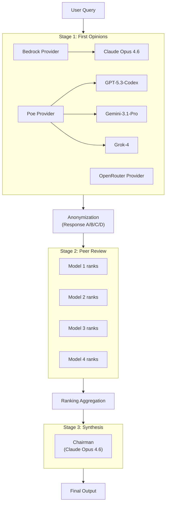

# LLM Council


Multi-model LLM deliberation with anonymized peer review. Available as a Claude Code skill and an OpenClaw skill.

## What It Does

Instead of asking a question to a single LLM, the council queries multiple models, has them anonymously rank each other's responses, and synthesizes a final answer. The anonymization prevents models from playing favorites.

**3-Stage Process:**

1. **Stage 1: First opinions** - All models answer independently
2. **Stage 2: Peer review** - Models rank responses using anonymous labels (Response A/B/C)
3. **Stage 3: Synthesis** - Chairman compiles the final answer based on rankings

## Architecture



## Usage

```
/council "What's the best approach for building a REST API?"
/council --config
```

Works in both Claude Code and OpenClaw.

## Setup

### Claude Code

Copy the `.claude/skills/council/` directory to your project.

### OpenClaw

Copy `skills/council/` into your OpenClaw workspace, or install via ClawHub:

```bash
clawhub install council
```

Then configure the API key in `~/.openclaw/openclaw.json`:

```json5
{
  skills: {
    entries: {
      council: { enabled: true, apiKey: "YOUR_POE_API_KEY" }
    }
  }
}
```

### API Keys

**Bedrock (Claude models):** AWS credentials must be configured (`~/.aws/credentials` or environment variables)

**Poe.com (GPT, Gemini, Grok):**
```bash
export POE_API_KEY=your-poe-api-key-here
```

Get your Poe API key at [poe.com/api_key](https://poe.com/api_key).

**OpenRouter (hundreds of models via single API):**
```bash
export OPENROUTER_API_KEY=your-openrouter-api-key-here
```

Get your OpenRouter API key at [openrouter.ai/keys](https://openrouter.ai/keys).

### Model Configuration

Edit the council config (`council-config.json`):

```json
{
  "council_models": [
    {"name": "Claude Opus 4.6", "provider": "bedrock", "model_id": "us.anthropic.claude-opus-4-6-v1:0", "budget_tokens": 10000},
    {"name": "GPT-5.3-Codex", "provider": "poe", "bot_name": "GPT-5.3-Codex", "web_search": true, "reasoning_effort": "high"},
    {"name": "Gemini-3.1-Pro", "provider": "poe", "bot_name": "Gemini-3.1-Pro", "web_search": true},
    {"name": "Grok-4", "provider": "poe", "bot_name": "Grok-4"}
  ],
  "chairman": {
    "name": "Claude Opus 4.6",
    "provider": "bedrock",
    "model_id": "us.anthropic.claude-opus-4-6-v1:0",
    "budget_tokens": 10000
  }
}
```

## Available Models

You can use **any model** available on Bedrock, Poe.com, or OpenRouter. Use `llm-council --list-models` to discover what's available with your current credentials.

### Bedrock
Any model available in your AWS Bedrock region. Examples:
- Anthropic: Claude Opus 4.6, Claude Sonnet 4
- Meta, Mistral, Cohere, and others available through Bedrock

### Poe.com
Any bot available on Poe's API. Examples:
- OpenAI: GPT-5.3-Codex, GPT-5.2, GPT-4o
- Google: Gemini-3.1-Pro, Gemini-3-Flash
- xAI: Grok-4
- Plus hundreds of other models and community bots

### OpenRouter
Any model on OpenRouter's API (OpenAI-compatible, real token usage). Examples:
- `openai/gpt-4o`, `openai/o1-preview`
- `anthropic/claude-3.5-sonnet`, `google/gemini-pro`
- `meta-llama/llama-3-70b`, `mistralai/mixtral-8x7b`
- Hundreds more — run `llm-council --list-models` to see all

## Direct Usage

Install and run the council as a Python package:

```bash
# Install with uv (recommended)
uv sync

# Or install with pip
pip install -e .

# Run the council (full 3-stage deliberation)
llm-council "What is the capital of France?"

# Run only Stage 1 (individual responses, no ranking)
llm-council --stage 1 "What is the best programming language?"

# Run Stages 1-2 (responses + rankings, no synthesis)
llm-council --stage 2 "Compare REST vs GraphQL"

# Dry run (preview cost/model list, no API calls)
llm-council --dry-run "expensive question"

# List available models from all providers
llm-council --list-models

# Flatten a codebase and ask for review
llm-council --flatten ./src "Review this code for bugs"
```

## Output Format

```markdown
## LLM Council Response

### Model Rankings (by peer review)

| Rank | Model | Avg Position |
|------|-------|--------------|
| 1 | Claude Opus 4.6 | 1.5 |
| 2 | GPT-5.3-Codex | 2.0 |
| 3 | Gemini-3.1-Pro | 2.8 |
| 4 | Grok-4 | 3.7 |

*Rankings determined by anonymous peer evaluation*

---

### Synthesized Answer

**Chairman:** Claude Opus 4.6

[Final synthesized response...]
```

## Background

This project was inspired by the desire to evaluate multiple LLMs side by side and see their cross-opinions on each other's outputs. The key innovation is the anonymized peer review - models evaluate "Response A", "Response B", etc. without knowing which model produced each response.

## Known Limitations

- **No built-in caching** - repeated queries re-query all models, increasing latency and API costs
- **No streaming output** - waits for full responses from all models before displaying results

## Contributing

Contributions are welcome! To contribute:

1. Fork the repository
2. Create a feature branch (`git checkout -b feature/your-feature`)
3. Make your changes and add tests
4. Submit a pull request

## License

This project is licensed under the MIT License. See the [LICENSE](LICENSE) file for details.
