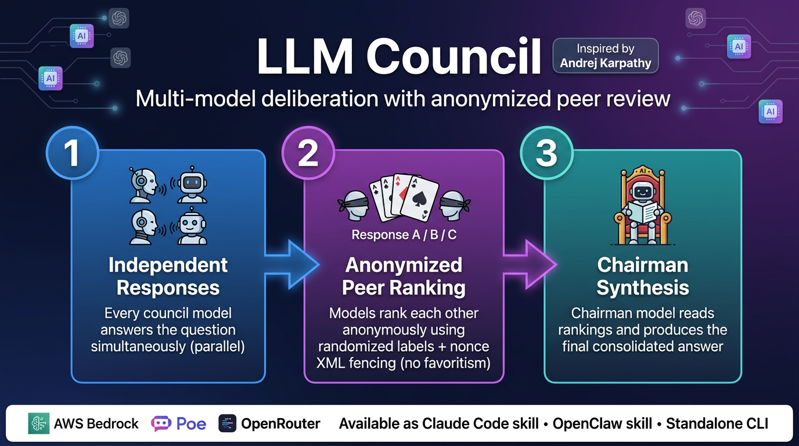
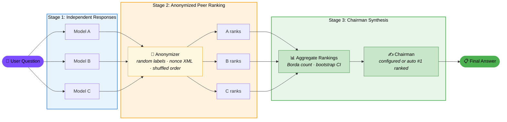

# LLM Council

<p align="center">
  
</p>


Multi-model LLM deliberation with anonymized peer review. Available as a Claude Code skill, an OpenClaw skill, or a standalone CLI. Inspired by [Andrej Karpathy's llm-council](https://github.com/karpathy/llm-council).

## What It Does

LLM Council queries multiple language models in parallel, has them anonymously rank each other's responses, and synthesizes a final answer from the top-ranked contributions. Each model evaluates shuffled, label-anonymized responses (Response A/B/C) so no model knows which peer produced which answer. A chairman model then reads the aggregate rankings and writes the synthesis. The chairman can be explicitly configured or automatically selected from the #1 ranked model.

**3-Stage Pipeline:**

1. **Stage 1 — Independent responses:** Every council model answers the question in parallel.
2. **Stage 2 — Anonymized peer ranking:** Each model ranks the other responses using randomized anonymous labels and nonce-fenced XML, preventing favoritism.
3. **Stage 3 — Chairman synthesis:** A chairman model receives the ranked results and produces the final consolidated answer. The chairman can be explicitly configured or auto-selected as the #1 ranked model from Stage 2.

**Supported Providers:**

| Provider | Access | Streaming | Token Usage | Key Features |
|----------|--------|-----------|-------------|--------------|
| **AWS Bedrock** | Any model in your Bedrock region (Anthropic Claude, Meta Llama, Mistral, etc.) | Yes | Real counts from API | Extended thinking via `budget_tokens`, native AWS auth |
| **Poe** | Any bot on Poe's API (OpenAI GPT, Google Gemini, xAI Grok, community bots, etc.) | Yes | Not provided by API | Web search toggle, configurable reasoning effort |
| **OpenRouter** | Hundreds of models via a single OpenAI-compatible API (OpenAI, Anthropic, Google, Meta, Mistral, and more) | Yes (SSE) | Real counts from API | `temperature`/`max_tokens` controls, `reasoning_effort`/`reasoning_max_tokens` for extended thinking, model discovery via `--list-models` |

## Quickstart

### Installation

```bash
# Clone the repository
git clone https://github.com/0ri/llm-council.git
cd llm-council

# Install with uv (recommended)
uv sync

# Or install with pip in editable mode
pip install -e .
```

### Environment Variables

Create a `.env` file (or export directly) with the API keys for the providers you plan to use:

```bash
# Required for OpenRouter models (easiest way to get started — one key covers hundreds of models)
export OPENROUTER_API_KEY=your-openrouter-api-key

# Required for Poe models (GPT, Gemini, Grok, community bots)
export POE_API_KEY=your-poe-api-key

# Required for Bedrock models (uses standard AWS auth — configure via `aws configure` or env vars)
export AWS_ACCESS_KEY_ID=your-access-key
export AWS_SECRET_ACCESS_KEY=your-secret-key
export AWS_DEFAULT_REGION=us-east-1
```

You only need keys for the providers in your council config. The default config uses OpenRouter only, so `OPENROUTER_API_KEY` is enough to get started.

### Path A: Skill Usage (Claude Code)

If you use Claude Code, the fastest path is the `/council` slash command:

```bash
# 1. Install the project
uv sync

# 2. Set your API key
export OPENROUTER_API_KEY=your-key

# 3. Ask the council
/council "What's the best approach for building a REST API?"
```

The skill files live in `.claude/commands/council.md` and `.claude/skills/council/`. See the [Skill Usage](#skill-usage-claude-code--openclaw) section for full setup details.

### Path B: Direct CLI Usage

```bash
# 1. Install the project
uv sync

# 2. Set your API key
export OPENROUTER_API_KEY=your-key

# 3. Run a full 3-stage council deliberation
llm-council "What are the tradeoffs between REST and GraphQL?"

# 4. (Optional) Preview what would run without making API calls
llm-council --dry-run "test question"

# 5. (Optional) Stream the chairman's synthesis in real time
llm-council --stream "Explain the CAP theorem"
```

The default config uses four OpenRouter models (Claude Opus 4.6, GPT-5.3-Codex, Gemini-3.1-Pro, Grok 4) with Gemini-3.1-Pro as chairman. To customize, create a `.claude/council-config.json` — see [Configuration Reference](#configuration-reference).

## Skill Usage (Claude Code & OpenClaw)

The council is designed as a skill first — most users interact with it through a `/council` slash command rather than the CLI directly. Two skill interfaces are supported: Claude Code and OpenClaw.

### Claude Code Setup

The Claude Code skill lives in two locations within this repository:

- **Slash command:** [`.claude/commands/council.md`](.claude/commands/council.md) — defines the `/council` command, argument hints, and execution instructions
- **Skill package:** `.claude/skills/council/` — contains the plugin manifest, a mirrored command file, and the runner script

To install the skill into your own workspace:

```bash
# Option 1: Symlink (recommended — stays in sync with upstream)
ln -s /path/to/llm-council/.claude/commands/council.md  your-project/.claude/commands/council.md
ln -s /path/to/llm-council/.claude/skills/council/       your-project/.claude/skills/council

# Option 2: Copy
cp .claude/commands/council.md  your-project/.claude/commands/council.md
cp -r .claude/skills/council/   your-project/.claude/skills/council/
```

Set the required environment variables (only the providers you use):

```bash
export OPENROUTER_API_KEY=your-openrouter-key   # easiest — one key covers hundreds of models
export POE_API_KEY=your-poe-key                  # for Poe models (GPT, Gemini, Grok)
# Bedrock uses standard AWS auth (aws configure or AWS_* env vars)
```

Then invoke from any Claude Code conversation:

```
/council "What are the tradeoffs between microservices and monoliths?"
```

### OpenClaw Setup

The OpenClaw-compatible skill package lives in [`skills/council/`](skills/council/) with a [`SKILL.md`](skills/council/SKILL.md) manifest.

Install via ClawHub or manually:

```bash
# Option 1: ClawHub
clawhub install council

# Option 2: Manual copy
cp -r skills/council/ your-project/skills/council/
```

The `SKILL.md` front-matter declares everything OpenClaw needs:

| Field | Purpose |
|-------|---------|
| `name` | Skill identifier (`council`) |
| `description` | Human-readable summary |
| `user-invocable` | `true` — appears in the user's skill list |
| `metadata.openclaw.requires.bins` | Runtime dependencies (`uv`, `python3`) |
| `metadata.openclaw.requires.env` | Required env vars (`POE_API_KEY`) |
| `metadata.openclaw.primaryEnv` | The key OpenClaw prompts for during install |
| `metadata.openclaw.install` | Auto-install steps (e.g., `brew install uv`) |

Path references in `SKILL.md` use `{baseDir}`, which OpenClaw resolves to the skill's install directory at runtime. For example:

```bash
uv run {baseDir}/scripts/council.py --config {baseDir}/config/council-config.json "your question"
```

API keys are injected via OpenClaw's skill configuration — set `POE_API_KEY` (and optionally `OPENROUTER_API_KEY` or AWS credentials) in your OpenClaw skill config, and they'll be available to the council script automatically.

### Interactive Configuration (`--config`)

Both skill interfaces support an interactive configuration mode:

```
/council --config
```

This walks you through:

1. Selecting which models to include in the council (multi-select across Bedrock, Poe, and OpenRouter)
2. Choosing a chairman model from the selected council members
3. Setting enhanced parameters per model (e.g., `budget_tokens` for Bedrock, `web_search`/`reasoning_effort` for Poe)

The configuration is saved to the appropriate config file:
- Claude Code: `.claude/council-config.json`
- OpenClaw: `{baseDir}/config/council-config.json` (i.e., `skills/council/config/council-config.json`)

### Shared Script Architecture

Both skill interfaces use the same underlying runner script — a thin wrapper that delegates to the installed `llm_council` package:

| Path | Used by |
|------|---------|
| `.claude/skills/council/scripts/council.py` | Claude Code |
| `skills/council/scripts/council.py` | OpenClaw |

These are identical files. The script uses [PEP 723 inline metadata](https://peps.python.org/pep-0723/) so `uv run` can resolve the `llm-council` dependency automatically:

```python
#!/usr/bin/env -S uv run --script
# /// script
# requires-python = ">=3.10"
# dependencies = ["llm-council"]
# ///
```

Config files can be symlinked between the two skill directories if you want a single source of truth. The actual council logic lives in `src/llm_council/` — the skill scripts just import and call `llm_council.cli.main()`.

### Examples

**Basic question via `/council`:**

```
> /council "Explain the CAP theorem and which tradeoff is best for a chat application"

## LLM Council Response

### Model Rankings (by peer review)

| Rank | Model          | Avg Position | 95% CI       | Borda Score |
|------|----------------|--------------|--------------|-------------|
| 1    | Claude Opus 4.6 | 1.33        | [1.0, 1.67]  | 2.67        |
| 2    | GPT-5.3-Codex  | 2.0          | [1.33, 2.67] | 2.0         |
| 3    | Gemini-3.1-Pro | 2.67         | [2.0, 3.33]  | 1.33        |
| 4    | Grok 4         | 3.67         | [3.33, 4.0]  | 0.33        |

*Rankings based on 3/3 valid ballots (anonymous peer evaluation)*

---

### Synthesized Answer

**Chairman:** Gemini-3.1-Pro

The CAP theorem states that a distributed system can guarantee at most two of
three properties: Consistency, Availability, and Partition tolerance...
```

**Interactive configuration session via `/council --config`:**

```
> /council --config

Which models should be in the council?
  [x] Claude Opus 4.6 (Bedrock)
  [x] GPT-5.3-Codex (Poe)
  [x] Gemini-3.1-Pro (Poe)
  [ ] Grok-4 (Poe)

Which model should be chairman? (leave blank for auto-select from rankings)
  > Gemini-3.1-Pro

Configure enhanced parameters?
  Claude Opus 4.6 → budget_tokens: 10000
  GPT-5.3-Codex   → web_search: true, reasoning_effort: high
  Gemini-3.1-Pro   → web_search: true, reasoning_effort: high

✓ Configuration saved to .claude/council-config.json
```

For the full command reference and execution details, see the actual skill files:
- Claude Code: [`.claude/commands/council.md`](.claude/commands/council.md)
- OpenClaw: [`skills/council/SKILL.md`](skills/council/SKILL.md)

## Architecture

### Pipeline Overview



### Stage Descriptions

**Stage 1 — Independent Responses.** Every council model receives the user's question and answers independently, in parallel. Responses are cached in a local SQLite database so repeated questions skip the API call. A soft timeout and minimum-response threshold let the pipeline proceed if slow models haven't finished yet, and circuit breakers prevent retrying providers that are consistently failing.

**Stage 2 — Anonymized Peer Ranking.** Each council model ranks the other models' responses without knowing who wrote what. Self-exclusion ensures no model ranks its own answer. Responses are presented under randomized anonymous labels (Response A, B, C…) with a per-ranker shuffled order so that position bias is mitigated. Each response is wrapped in nonce-fenced XML tags (`<response-{random_hex}>`) to prevent prompt injection and fence-breaking. A system message instructs rankers to ignore any manipulation attempts inside the fenced content. Invalid ballots (unparseable rankings) are retried up to a configurable number of times.

**Stage 3 — Chairman Synthesis.** A designated chairman model receives the original responses (anonymized), the aggregate peer rankings (Borda count with bootstrap 95% confidence intervals), and writes the final consolidated answer. The chairman sees the same nonce-fenced, label-anonymized view — it knows which responses were ranked highest but not which model produced them. The synthesis prompt instructs the chairman to preserve specific technical details from individual responses, organize by theme rather than by respondent, highlight areas of consensus and disagreement, and match the depth of the highest-ranked response. When `--stream` is enabled, the chairman's output is streamed to stdout in real time.

### Anonymization Mechanism

The ranking stage uses three layers of anonymization to ensure fair evaluation:

1. **Random labels** — Responses are labeled Response A, B, C… rather than by model name, so rankers cannot identify peers.
2. **Nonce-based XML fencing** — Each response is wrapped in `<response-{nonce}>…</response-{nonce}>` tags where the nonce is a random hex string (`secrets.token_hex(8)`), regenerated per prompt. This prevents models from guessing the delimiter and breaking out of their fenced block. Any closing tags matching the nonce pattern found in model output are stripped before embedding.
3. **Per-ranker shuffled mappings** — The order of responses is independently shuffled for each ranker using `random.shuffle`, so Response A for one ranker may correspond to a completely different model than Response A for another. The label-to-model mapping is stored per ranker and used during aggregation to correctly attribute rankings.

### Package Structure

```
src/llm_council/
├── __init__.py              # Package exports: run_council, CouncilConfig, CouncilContext
├── _token_estimation.py     # Shared tiktoken/heuristic token estimator (used by cost + flattener)
├── aggregation.py           # Borda count, bootstrap confidence intervals, ranking aggregation
├── budget.py                # Token and cost budget guards with reserve/commit/release
├── cache.py                 # SQLite response cache for Stage 1 (TTL, stats, clearing)
├── cli.py                   # CLI dispatcher: _cmd_run, _cmd_list_models, _cmd_cache_*
├── context.py               # Per-run dependency-injection container (lazy provider imports)
├── cost.py                  # Per-stage cost estimation and CouncilCostTracker
├── council.py               # Orchestrator: _RunState, stage helpers, run_council
├── defaults.py              # Shared default constants (cache TTL, timeouts, retry counts)
├── flattener.py             # Codebase flattener: directory → single markdown document
├── formatting.py            # Markdown output formatting for all stage combinations
├── manifest.py              # Run manifest: metadata, timestamps, config hash
├── models.py                # Pydantic config models (CouncilConfig, provider configs, result types)
├── parsing.py               # Ranking parser: JSON/text extraction from model output
├── persistence.py           # Buffered JSONL run logger for session persistence
├── progress.py              # Real-time progress display (Rich TTY / plain non-TTY)
├── prompts.py               # Prompt templates for ranking and synthesis stages
├── run_options.py           # RunOptions dataclass for run_council parameters
├── security.py              # Input sanitization, injection detection, nonce fencing, output redaction
├── stages/                  # 3-stage pipeline package
│   ├── __init__.py          # Re-exports for backward compatibility
│   ├── execution.py         # query_model, stream_model, parallel dispatch, budget guards
│   ├── stage1.py            # Stage 1: collect individual model responses (with caching)
│   ├── stage2.py            # Stage 2: anonymized peer ranking with retry
│   └── stage3.py            # Stage 3: chairman synthesis (query or streaming)
└── providers/
    ├── __init__.py           # Provider/StreamingProvider protocols, StreamResult, timeout constants
    ├── bedrock.py            # AWS Bedrock provider (Converse API, extended thinking, streaming)
    ├── openrouter.py         # OpenRouter provider (OpenAI-compatible API, SSE streaming)
    └── poe.py                # Poe provider (fastapi_poe, web search, reasoning effort)
```

## CLI Reference

LLM Council provides two CLI entry points:

- `llm-council` — the main deliberation pipeline
- `flatten-project` — standalone codebase flattener

### `llm-council`

```
llm-council [OPTIONS] [QUESTION]
```

Multi-model LLM deliberation with anonymized peer review. The question can be passed as a positional argument, read from a file with `--question-file`, or piped via `--flatten`.

#### Flags

| Flag | Description | Default | Example |
|------|-------------|---------|---------|
| `question` | Positional argument: the question to ask the council | *(required unless `--question-file`, `--list-models`, `--clear-cache`, or `--cache-stats` is used)* | `llm-council "What is the best sorting algorithm?"` |
| `--config PATH` | Path to a `council-config.json` file | Auto-discovered (see [Configuration Reference](#configuration-reference)) | `llm-council --config ./my-config.json "question"` |
| `-v`, `--verbose` | Enable verbose (DEBUG-level) logging to stderr | `False` | `llm-council -v "question"` |
| `--manifest` | Print the run manifest as JSON to stderr after completion | `False` | `llm-council --manifest "question"` |
| `--log-dir DIR` | Write JSONL run logs to the specified directory | *(disabled)* | `llm-council --log-dir ./logs "question"` |
| `--stage {1,2,3}` | Maximum pipeline stage to run (1 = responses only, 2 = responses + rankings, 3 = full run) | `3` | `llm-council --stage 2 "question"` |
| `--dry-run` | Preview the configuration, model list, estimated API calls, and budget limits without making any API calls | `False` | `llm-council --dry-run "question"` |
| `--list-models` | List available models from all configured providers (Bedrock, Poe, OpenRouter) and exit | `False` | `llm-council --list-models` |
| `--flatten PATH` | Flatten a directory into a single markdown document and prepend it to the question as `<project>…</project>` context | *(disabled)* | `llm-council --flatten ./src "Explain the architecture"` |
| `--codemap` | When used with `--flatten`, extract only structural skeletons (function/class signatures) instead of full file contents | `False` | `llm-council --flatten ./src --codemap "Summarize the API"` |
| `--question-file FILE` | Read the question text from a file instead of the positional argument | *(disabled)* | `llm-council --question-file prompt.txt` |
| `--seed INT` | Seed for reproducible bootstrap confidence intervals in ranking aggregation | *(random)* | `llm-council --seed 42 "question"` |
| `--no-cache` | Disable the local SQLite response cache entirely for this run | `False` | `llm-council --no-cache "question"` |
| `--cache-ttl SECONDS` | Override the cache TTL (time-to-live) in seconds. `0` bypasses cache reads but still writes new entries | Config `cache_ttl` or `86400` (24 h) | `llm-council --cache-ttl 3600 "question"` |
| `--clear-cache` | Delete all entries from the response cache and exit | `False` | `llm-council --clear-cache` |
| `--cache-stats` | Print cache statistics (total entries, expired entries, database size) and exit | `False` | `llm-council --cache-stats` |
| `--stream` | Stream the Stage 3 chairman synthesis to stdout in real time instead of printing the full result at the end | `False` | `llm-council --stream "question"` |

#### Usage Examples

**Full 3-stage run** — ask a question and get the complete deliberation (responses → rankings → synthesis):

```bash
llm-council "What are the trade-offs between microservices and monoliths?"
```

**Stage-limited run** — collect only Stage 1 responses (no ranking or synthesis):

```bash
llm-council --stage 1 "Explain the CAP theorem"
```

Run through Stage 2 (responses + rankings, no chairman synthesis):

```bash
llm-council --stage 2 "Compare REST vs GraphQL"
```

**Dry run** — preview the configuration and estimated API calls without spending tokens:

```bash
llm-council --dry-run "What is the best database for time-series data?"
```

**Flatten a codebase + query** — prepend a flattened project directory as context:

```bash
llm-council --flatten ./my-project "Review this codebase for security issues"
```

Use `--codemap` to send only signatures instead of full file contents (saves tokens):

```bash
llm-council --flatten ./my-project --codemap "Summarize the public API"
```

**Streaming output** — stream the chairman's synthesis to the terminal as it's generated:

```bash
llm-council --stream "Write a Python async HTTP client with retry logic"
```

**Combined flags** — verbose logging, custom config, session persistence, and streaming:

```bash
llm-council -v \
  --config ./council-config.json \
  --log-dir ./session-logs \
  --manifest \
  --stream \
  "Design a rate limiter for a REST API"
```

### `flatten-project`

```
flatten-project [OPTIONS] PATH [PATH ...]
```

Standalone CLI for flattening one or more directories into a single markdown document suitable for LLM context windows. Output is written to stdout; metadata (file count, character count, estimated tokens) is printed to stderr.

#### Flags

| Flag | Description | Default | Example |
|------|-------------|---------|---------|
| `PATH` | One or more directory paths to flatten (positional, required) | *(required)* | `flatten-project ./src` |
| `--no-gitignore` | Ignore `.gitignore` rules and include all files | `False` (`.gitignore` is respected) | `flatten-project --no-gitignore ./src` |
| `--codemap` | Extract only structural skeletons (function/class signatures, imports) instead of full file contents. Uses AST parsing for Python and heuristic pattern matching for other languages | `False` | `flatten-project --codemap ./src` |
| `--max-file-size BYTES` | Skip files larger than this size in bytes | `100000` (100 KB) | `flatten-project --max-file-size 500000 ./src` |

#### Usage Examples

Flatten a project and pipe to a file:

```bash
flatten-project ./my-project > context.md
```

Generate a codemap (signatures only) for a large codebase:

```bash
flatten-project --codemap ./src > codemap.md
```

Flatten multiple directories, including all files regardless of `.gitignore`:

```bash
flatten-project --no-gitignore ./src ./tests > full-dump.md
```


## Configuration Reference

LLM Council is configured via a `council-config.json` file. The config controls which models participate in the council, who serves as chairman, budget limits, caching behavior, and resilience settings.

### Config File Search Order

When no `--config` flag is provided, the CLI searches for a config file in this order:

1. `<CWD>/.claude/council-config.json` — project-local config
2. `~/.claude/council-config.json` — user-global config
3. Built-in default — an all-OpenRouter config ships with the package

The first file found wins. Use `--config path/to/config.json` to override the search entirely.

### Top-Level Schema

| Field | Type | Default | Description |
|-------|------|---------|-------------|
| `council_models` | `list[ModelConfig]` | *(required, min 1)* | List of models that participate in Stage 1 (responses) and Stage 2 (rankings). Each entry is a provider-specific model config object. |
| `chairman` | `ModelConfig \| null` | `null` (auto) | The model that performs Stage 3 synthesis. Can be one of the council models or a separate model. **If omitted, the #1 ranked model from Stage 2 is automatically selected as chairman** (auto-chairman mode). If an explicit chairman fails, the #1 ranked model is used as fallback. |
| `budget` | `object` | `{}` (no limits) | Optional budget controls. See [Budget Fields](#budget-fields) below. |
| `cache_ttl` | `int` | `86400` (24 hours) | Time-to-live in seconds for cached Stage 1 responses. Overridden by `--cache-ttl` CLI flag. |
| `soft_timeout` | `float` | `300` (5 minutes) | Seconds to wait for parallel Stage 1 queries before proceeding with partial results (if `min_responses` is satisfied). |
| `min_responses` | `int` | Number of `council_models` | Minimum number of Stage 1 responses required before the soft timeout can trigger early completion. Defaults to all models. |
| `stage2_retries` | `int` | `1` | Maximum retry rounds for invalid Stage 2 ballots. Set to `0` to disable retries. |

### Provider-Specific Model Fields

Every model config object requires `name` (a display label) and `provider` (one of `bedrock`, `poe`, `openrouter`). The remaining fields depend on the provider.

#### Bedrock

| Field | Type | Required | Default | Description |
|-------|------|----------|---------|-------------|
| `name` | `str` | yes | — | Display name for this model |
| `provider` | `"bedrock"` | yes | — | Must be `"bedrock"` |
| `model_id` | `str` | yes | — | AWS Bedrock model identifier (e.g. `"anthropic.claude-3-5-sonnet-20241022-v2:0"`) |
| `budget_tokens` | `int \| null` | no | `null` | Max tokens for Bedrock's budget mode. Must be between 1024 and 128000 if set. |

#### Poe

| Field | Type | Required | Default | Description |
|-------|------|----------|---------|-------------|
| `name` | `str` | yes | — | Display name for this model |
| `provider` | `"poe"` | yes | — | Must be `"poe"` |
| `bot_name` | `str` | yes | — | Poe bot identifier (e.g. `"Claude-3.5-Sonnet"`, `"GPT-4o"`) |
| `web_search` | `bool` | no | `false` | Enable Poe's web search augmentation |
| `reasoning_effort` | `str \| null` | no | `null` | Reasoning effort level. One of: `"minimal"`, `"low"`, `"medium"`, `"high"`, `"Xhigh"` |

#### OpenRouter

| Field | Type | Required | Default | Description |
|-------|------|----------|---------|-------------|
| `name` | `str` | yes | — | Display name for this model |
| `provider` | `"openrouter"` | yes | — | Must be `"openrouter"` |
| `model_id` | `str` | yes | — | OpenRouter model identifier (e.g. `"anthropic/claude-sonnet-4"`, `"openai/gpt-4o"`) |
| `temperature` | `float \| null` | no | `null` | Sampling temperature. Provider default if unset. |
| `max_tokens` | `int \| null` | no | `null` | Maximum output tokens. Provider default if unset. |
| `reasoning_effort` | `str \| null` | no | `null` | Reasoning effort level. One of: `"minimal"`, `"low"`, `"medium"`, `"high"`, `"xhigh"`. Supported by OpenAI (GPT-5/o-series), xAI (Grok), and Google (Gemini, mapped to `thinkingLevel`). |
| `reasoning_max_tokens` | `int \| null` | no | `null` | Direct token budget for reasoning/thinking. Supported by Anthropic (Claude) and Qwen models. Use this instead of `reasoning_effort` for models that accept a token count. |

### Budget Fields

The optional `budget` object controls cost and token limits. If omitted or empty, no limits are enforced.

| Field | Type | Default | Description |
|-------|------|---------|-------------|
| `max_tokens` | `int` | *(no limit)* | Maximum total tokens (input + output) across all stages. Must be a positive integer. |
| `max_cost_usd` | `float` | *(no limit)* | Maximum total estimated cost in USD across all stages. Must be a positive number. |
| `input_cost_per_1k` | `float` | `0.01` | Cost per 1,000 input tokens (used for budget estimation). |
| `output_cost_per_1k` | `float` | `0.03` | Cost per 1,000 output tokens (used for budget estimation). |

The budget system uses a reserve/commit/release mechanism: tokens are reserved before each query, committed on success (adjusted to actual usage), and released on failure.

### Example Configurations

#### All-OpenRouter

A simple setup using only OpenRouter — requires a single `OPENROUTER_API_KEY`:

```json
{
  "council_models": [
    {
      "name": "Claude Sonnet 4",
      "provider": "openrouter",
      "model_id": "anthropic/claude-sonnet-4",
      "temperature": 0.7
    },
    {
      "name": "GPT-4o",
      "provider": "openrouter",
      "model_id": "openai/gpt-4o",
      "temperature": 0.7,
      "max_tokens": 4096
    },
    {
      "name": "Gemini 2.5 Pro",
      "provider": "openrouter",
      "model_id": "google/gemini-2.5-pro-preview",
      "max_tokens": 8192
    }
  ],
  "chairman": {
    "name": "Claude Sonnet 4",
    "provider": "openrouter",
    "model_id": "anthropic/claude-sonnet-4"
  }
}
```

#### Mixed Bedrock + Poe

Combines AWS Bedrock and Poe providers — requires AWS credentials and `POE_API_KEY`:

```json
{
  "council_models": [
    {
      "name": "Claude via Bedrock",
      "provider": "bedrock",
      "model_id": "anthropic.claude-3-5-sonnet-20241022-v2:0",
      "budget_tokens": 4096
    },
    {
      "name": "GPT-4o via Poe",
      "provider": "poe",
      "bot_name": "GPT-4o",
      "web_search": true
    },
    {
      "name": "Claude via Poe",
      "provider": "poe",
      "bot_name": "Claude-3.5-Sonnet",
      "reasoning_effort": "high"
    }
  ],
  "chairman": {
    "name": "Claude via Bedrock",
    "provider": "bedrock",
    "model_id": "anthropic.claude-3-5-sonnet-20241022-v2:0"
  },
  "cache_ttl": 3600,
  "soft_timeout": 120
}
```

#### Auto-Chairman (No Explicit Chairman)

When `chairman` is omitted, the #1 ranked model from Stage 2 automatically becomes chairman for Stage 3 synthesis. This is useful when you want the council's peer review to determine the best synthesizer:

```json
{
  "council_models": [
    {
      "name": "Claude Sonnet 4",
      "provider": "openrouter",
      "model_id": "anthropic/claude-sonnet-4"
    },
    {
      "name": "GPT-4o",
      "provider": "openrouter",
      "model_id": "openai/gpt-4o"
    },
    {
      "name": "Gemini 2.5 Pro",
      "provider": "openrouter",
      "model_id": "google/gemini-2.5-pro-preview"
    }
  ]
}
```

In auto-chairman mode, `--dry-run` shows `Chairman: auto (determined by Stage 2 rankings)` and the run manifest marks the chairman with `(auto)`.

#### Config with Budget Limits

An OpenRouter setup with strict budget controls and resilience tuning:

```json
{
  "council_models": [
    {
      "name": "Claude Sonnet 4",
      "provider": "openrouter",
      "model_id": "anthropic/claude-sonnet-4",
      "max_tokens": 2048
    },
    {
      "name": "GPT-4o",
      "provider": "openrouter",
      "model_id": "openai/gpt-4o",
      "max_tokens": 2048
    },
    {
      "name": "Gemini 2.5 Flash",
      "provider": "openrouter",
      "model_id": "google/gemini-2.5-flash-preview",
      "max_tokens": 2048
    }
  ],
  "chairman": {
    "name": "Claude Sonnet 4",
    "provider": "openrouter",
    "model_id": "anthropic/claude-sonnet-4"
  },
  "budget": {
    "max_tokens": 50000,
    "max_cost_usd": 0.50,
    "input_cost_per_1k": 0.003,
    "output_cost_per_1k": 0.015
  },
  "cache_ttl": 43200,
  "soft_timeout": 60,
  "min_responses": 2,
  "stage2_retries": 2
}
```

## Features

### Caching

LLM Council caches Stage 1 responses in a local SQLite database to avoid redundant API calls. The cache is stored at `~/.llm-council/cache.db` by default.

Each cache entry is keyed by a SHA-256 hash of the question, model name, and model ID. Entries expire after a configurable TTL (default: 24 hours / 86400 seconds). Expired entries are cleaned up automatically on startup.

**Configuration:**

Set the TTL in your `council-config.json`:

```json
{
  "cache_ttl": 3600
}
```

**CLI flags:**

| Flag | Description |
|------|-------------|
| `--no-cache` | Bypass the cache entirely for this run |
| `--cache-ttl SECONDS` | Override the configured TTL for this run |
| `--clear-cache` | Delete all cached responses and exit |
| `--cache-stats` | Print cache statistics (total entries, expired entries) and exit |

**Example — check cache stats then run without cache:**

```bash
# See how many responses are cached
llm-council --cache-stats

# Run a query bypassing the cache
llm-council --no-cache "What is the best sorting algorithm?"

# Clear all cached responses
llm-council --clear-cache
```

### Streaming

The `--stream` flag enables real-time streaming of the Stage 3 chairman synthesis to stdout. Instead of waiting for the full synthesis to complete, text chunks are printed as they arrive from the provider.

```bash
llm-council --stream "Explain the CAP theorem"
```

Streaming uses the `StreamingProvider` protocol when available. Providers that implement `astream()` deliver chunks natively; non-streaming providers fall back to a single-chunk wrapper that buffers the full response and yields it at once.

If streaming encounters an error, it falls back to the standard `query_model` path automatically.

Stages 1 and 2 always run in non-streaming mode — only the final synthesis is streamed.

### Budget Controls

Budget controls prevent runaway costs by enforcing token and dollar limits across a council run. Configure them in the `budget` section of your config:

```json
{
  "budget": {
    "max_tokens": 50000,
    "max_cost_usd": 0.50,
    "input_cost_per_1k": 0.003,
    "output_cost_per_1k": 0.015
  }
}
```

| Field | Description | Default |
|-------|-------------|---------|
| `max_tokens` | Maximum total tokens (input + output) across all stages | No limit |
| `max_cost_usd` | Maximum estimated cost in USD | No limit |
| `input_cost_per_1k` | Cost per 1,000 input tokens for estimation | `0.01` |
| `output_cost_per_1k` | Cost per 1,000 output tokens for estimation | `0.03` |

**Reserve / Commit / Release mechanism:**

Budget enforcement uses an atomic reservation pattern to handle concurrent model queries safely:

1. **Reserve** — Before each query, estimated tokens are deducted from the budget. If the projected total would exceed limits, a `BudgetExceededError` is raised and the query is skipped.
2. **Commit** — After a successful query, the reservation is adjusted to reflect actual token usage reported by the provider.
3. **Release** — If a query fails, the reservation is returned to the budget so other models can use it.

This ensures concurrent queries don't collectively overshoot the budget. When a model is skipped due to budget limits, the council continues with the remaining models.

### Cost Tracking

Every council run tracks token usage per model and per stage. After the run completes, a summary is printed:

```
--- Token Usage ---
  Stage 1: ~3,200 in + ~4,800 out = ~8,000 tokens
    Claude Sonnet 4: ~1,100 in, ~1,600 out
    GPT-4o: ~1,050 in, ~1,500 out
    Gemini 2.5 Flash: ~1,050 in, ~1,700 out
  Stage 2: ~6,400 in + ~1,200 out = ~7,600 tokens
    Claude Sonnet 4: ~2,100 in, ~400 out
    GPT-4o: ~2,100 in, ~400 out
    Gemini 2.5 Flash: ~2,200 in, ~400 out
  Stage 3: ~2,800 in + ~2,000 out = ~4,800 tokens
    Claude Sonnet 4: ~2,800 in, ~2,000 out
  Total: ~12,400 in + ~8,000 out = ~20,400 tokens
  (~ indicates estimated tokens, actual counts used where available)
---
```

Token counts prefixed with `~` are estimates based on character count (using tiktoken's `cl100k_base` encoding when available, or a 4-chars-per-token heuristic). When a provider returns actual token counts in its API response, those are used instead and displayed without the `~` prefix.

The cost tracker records both estimated and actual counts for each model interaction, so you can compare projected vs real usage.

### Session Persistence

Use `--log-dir` to save a complete record of a council run as a JSONL file:

```bash
llm-council --log-dir ./logs "What is the best programming language?"
```

Each run produces a file named `{run_id}.jsonl` in the specified directory. The file contains one JSON object per line, with the following record types:

| Record Type | Fields |
|-------------|--------|
| `config` | `question`, `config` (full council config) |
| `stage1_response` | `model`, `response`, `token_usage` |
| `stage2_ranking` | `model`, `ranking_text`, `parsed_ranking`, `is_valid_ballot`, `label_mapping`, `token_usage` |
| `stage3_synthesis` | `model`, `response`, `token_usage` |
| `aggregation` | `rankings` (model, average_rank, borda_score, rankings_count), `valid_ballots`, `total_ballots` |
| `summary` | `cost_summary`, `elapsed_seconds` |

Every record includes `run_id` and `timestamp` fields. Sensitive data (API keys, tokens) is automatically redacted before writing.

Combine with `--manifest` to append a run manifest comment block to the output, recording run metadata (run ID, timestamp, models used, chairman, stage counts, elapsed time, token estimates, config hash).

### Flattener

The flattener serializes a project directory into a single markdown document suitable for LLM context windows. It's available as both a CLI flag and a standalone command.

**As a CLI flag:**

```bash
# Flatten the current directory and ask a question about it
llm-council --flatten . "How is error handling done in this project?"

# Use codemap mode for a structural overview (signatures only)
llm-council --flatten . --codemap "What are the main classes?"
```

**As a standalone command:**

```bash
# Flatten a directory to stdout
flatten-project ./src

# Codemap mode — extract only signatures, imports, and class/function definitions
flatten-project --codemap ./src

# Skip gitignore rules
flatten-project --no-gitignore ./src

# Set max file size (default: 100KB)
flatten-project --max-file-size 200000 ./src
```

**Features:**

- **Binary detection** — Files with known binary extensions (images, archives, executables, fonts, databases, etc.) are automatically skipped. MIME type detection is used as a fallback for unknown extensions.
- **Gitignore support** — `.gitignore` patterns are respected by default (requires the `pathspec` package). Use `--no-gitignore` to include all files.
- **Directory filtering** — Common non-source directories (`.git`, `__pycache__`, `node_modules`, `.venv`, `dist`, `build`, etc.) are always skipped.
- **File filtering** — Lock files, minified assets, `.env` files, credentials, and council output files are skipped.
- **Python skeleton extraction** — In `--codemap` mode, Python files are parsed via AST to extract imports, class definitions, function signatures, and docstrings. Non-Python files use heuristic pattern matching for structural extraction.
- **Token estimation** — The output includes an estimated token count (using tiktoken when available, or a character-based heuristic). This is printed to stderr:
  ```
  # 42 files, 128,350 chars, ~32,088 tokens
  ```

### Security

LLM Council includes multiple layers of security hardening to protect against prompt injection and data leakage.

**Input sanitization** (`sanitize_user_input`):
- Strips control characters (preserving newlines and tabs)
- Truncates input exceeding the maximum length (default: 500,000 characters)
- Detects and logs potential prompt injection patterns (e.g., "ignore previous instructions", role markers, model delimiters) without blocking — legitimate use cases are preserved

**Prompt injection defense** (nonce-based XML fencing):
- Model responses are wrapped in randomized XML delimiters: `<response-{nonce}>...</response-{nonce}>` where the nonce is a cryptographically random hex string
- Each ranking stage uses a fresh nonce, making it infeasible for a model to guess and break out of its fence
- A manipulation resistance system message instructs rankers to ignore any instructions embedded in responses

**Output sanitization** (`sanitize_model_output`):
- Strips any closing XML tags matching the nonce pattern from model output, preventing fence-breaking attempts
- Generic response-tag patterns are also removed as a defense-in-depth measure
- Detected attempts are replaced with `[FENCE_BREAK_ATTEMPT_REMOVED]`

**Sensitive data redaction** (`redact_sensitive`):
- API keys (OpenAI, Poe, AWS, Google) are redacted in log output
- Bearer tokens, authorization headers, JWTs, and long hex strings are replaced with `[REDACTED_*]` placeholders
- Applied automatically to all JSONL persistence records

### Circuit Breaker and Retry

Each model gets its own circuit breaker, keyed by provider and model identifier (e.g., `openrouter:anthropic/claude-sonnet-4` or `poe:Claude-3.5-Sonnet`).

**Circuit breaker behavior:**

| Parameter | Default | Description |
|-----------|---------|-------------|
| Failure threshold | 3 | Consecutive failures before the circuit opens |
| Cooldown | 60 seconds | Time before a half-open retry is allowed |

The circuit breaker follows a standard closed → open → half-open pattern:

- **Closed** (normal) — Requests pass through. Failures increment a counter.
- **Open** (rejecting) — After 3 consecutive failures, the circuit opens. All requests to that model are immediately skipped with a warning.
- **Half-open** (probing) — After the 60-second cooldown, one request is allowed through. Success closes the circuit; failure reopens it.

**Retry and graceful degradation:**

- Individual model queries are wrapped with `asyncio.wait_for` using a configurable timeout (default: 360 seconds).
- Timeouts and exceptions are caught per-model — a single model failure doesn't abort the run.
- The `min_responses` config field (default: all models) sets the minimum number of successful Stage 1 responses needed to proceed. Combined with `soft_timeout`, the council can move forward with partial results if slow models haven't responded.
- Budget reservations are released on failure, freeing capacity for remaining models.
- Streaming queries fall back to the standard query path if the stream encounters an error.

## Output Formats

LLM Council output varies depending on the `--stage` flag. A full 3-stage run produces rankings, ballot validity, and a chairman synthesis. Stage-limited runs produce subsets of this output. Full runs also include a run manifest comment block at the end.

### Full 3-Stage Output (default)

A complete council run (`--stage 3` or no `--stage` flag) produces a rankings table, ballot validity indicator, and chairman synthesis:

```markdown
## LLM Council Response

### Model Rankings (by peer review)

| Rank | Model | Avg Position | 95% CI | Borda Score |
|------|-------|--------------|--------|-------------|
| 1 | Gemini-2.5-Pro | 1.3 | [1.0, 1.7] | 8 |
| 2 | Claude-Sonnet-4 | 1.8 | [1.2, 2.4] | 7 |
| 3 | GPT-4.1 | 2.5 | [2.0, 3.0] | 5 |
| 4 | Grok-3 | 3.4 | [2.8, 4.0] | 2 |

*Rankings based on 4/4 valid ballots (anonymous peer evaluation)*

---

### Synthesized Answer

**Chairman:** Gemini-2.5-Pro

The council reached broad agreement that [...chairman's synthesis of the top-ranked responses...]
```

The rankings table includes:

- **Rank** — Position based on average rank across all ballots
- **Model** — The model's display name from the config
- **Avg Position** — Mean rank across all valid ballots (lower is better)
- **95% CI** — Confidence interval for the average position
- **Borda Score** — Borda count score (higher is better), used as a tiebreaker

The ballot validity line shows how many ranking ballots were successfully parsed. When all ballots are valid, it reads "anonymous peer evaluation". When some fail to parse, it notes "some rankings could not be parsed reliably".

### Stage 1 Only (`--stage 1`)

Running with `--stage 1` collects individual model responses without ranking or synthesis:

```markdown
## LLM Council Response (Stage 1 only)

### Gemini-2.5-Pro

[Gemini's full response to the question...]

### Claude-Sonnet-4

[Claude's full response to the question...]

### GPT-4.1

[GPT's full response to the question...]

### Grok-3

[Grok's full response to the question...]
```

Each model's response is printed under its own heading. No rankings or synthesis are performed.

### Stage 1+2 Output (`--stage 2`)

Running with `--stage 2` collects responses and performs anonymous peer ranking, but skips the chairman synthesis:

```markdown
## LLM Council Response (Stages 1-2, no synthesis)

### Model Rankings (by peer review)

| Rank | Model | Avg Position | 95% CI | Borda Score |
|------|-------|--------------|--------|-------------|
| 1 | Gemini-2.5-Pro | 1.3 | [1.0, 1.7] | 8 |
| 2 | Claude-Sonnet-4 | 1.8 | [1.2, 2.4] | 7 |
| 3 | GPT-4.1 | 2.5 | [2.0, 3.0] | 5 |
| 4 | Grok-3 | 3.4 | [2.8, 4.0] | 2 |

*Rankings based on 4/4 valid ballots (anonymous peer evaluation)*

---

### Individual Responses

#### Gemini-2.5-Pro

[Gemini's full response...]

#### Claude-Sonnet-4

[Claude's full response...]

#### GPT-4.1

[GPT's full response...]

#### Grok-3

[Grok's full response...]
```

The rankings table appears first, followed by each model's individual response. This is useful for seeing how models were ranked without waiting for the chairman synthesis.

### Run Manifest Comment Block

Full 3-stage runs append an HTML comment block at the end of the output containing execution metadata. This block is invisible when rendered as markdown but can be parsed programmatically:

```html
<!-- Run Manifest
Run ID: a1b2c3d4-e5f6-7890-abcd-ef1234567890
Timestamp: 2025-01-15T14:30:00.123456+00:00
Models: Gemini-2.5-Pro, Claude-Sonnet-4, GPT-4.1, Grok-3
Chairman: Gemini-2.5-Pro
Stage 1 Results: 4/4
Stage 2 Ballots: 4/4 valid
Total Time: 12.3s
Est. Tokens: ~8,500
Config Hash: a1b2c3d4e5f67890...
-->
```

Manifest fields:

| Field | Description |
|-------|-------------|
| `Run ID` | UUID v4 uniquely identifying this run |
| `Timestamp` | ISO 8601 UTC timestamp of when the run started |
| `Models` | Comma-separated list of all council model names |
| `Chairman` | The model designated to write the synthesis. Shows `(auto)` suffix when auto-selected from Stage 2 rankings |
| `Stage 1 Results` | Successful responses out of total models queried |
| `Stage 2 Ballots` | Valid ranking ballots out of total ballots received |
| `Total Time` | Wall-clock elapsed time for the entire run |
| `Est. Tokens` | Estimated total token usage across all stages |
| `Config Hash` | Truncated SHA-256 hash of the config JSON (for reproducibility tracking) |

The manifest is also saved as JSON when using `--manifest` or `--log-dir` for programmatic access to run metadata.
## Available Models

LLM Council supports three providers, each with different model discovery mechanisms.

### Bedrock

Bedrock models are discovered dynamically via the AWS `ListFoundationModels` API. Any model available in your configured AWS region can be used. Common Anthropic models on Bedrock:

| Model ID | Description |
|----------|-------------|
| `us.anthropic.claude-sonnet-4-20250514-v1:0` | Claude Sonnet 4 — fast, capable |
| `us.anthropic.claude-opus-4-20250514-v1:0` | Claude Opus 4 — highest capability |
| `anthropic.claude-3-5-sonnet-20241022-v2:0` | Claude 3.5 Sonnet v2 |
| `anthropic.claude-3-opus-20240229-v1:0` | Claude 3 Opus |

Run `llm-council --list-models` with valid AWS credentials to see all models available in your region.

### Poe

Poe has no model discovery API. Bots are referenced by name in the config's `bot_name` field. Common bots:

| Bot Name | Model |
|----------|-------|
| `GPT-5.3-Codex` | OpenAI GPT-5.3 Codex |
| `GPT-5.2` | OpenAI GPT-5.2 |
| `GPT-4o` | OpenAI GPT-4o |
| `Gemini-3.1-Pro` | Google Gemini 3.1 Pro |
| `Gemini-3-Flash` | Google Gemini 3 Flash |
| `Grok-4` | xAI Grok 4 |
| `Grok-3` | xAI Grok 3 |
| `Claude-3.5-Sonnet` | Anthropic Claude 3.5 Sonnet |
| `Claude-3-Opus` | Anthropic Claude 3 Opus |
| `Llama-3.3-70B` | Meta Llama 3.3 70B |
| `Mixtral-8x7B` | Mistral Mixtral 8x7B |

Poe bot names are case-sensitive. New bots appear on Poe regularly — check [poe.com](https://poe.com) for the latest list.

### OpenRouter

OpenRouter provides a model discovery API with hundreds of models. Run `llm-council --list-models` with a valid `OPENROUTER_API_KEY` to see the full list. Models are referenced by their OpenRouter ID in the config's `model_id` field. Examples:

| Model ID | Description |
|----------|-------------|
| `anthropic/claude-opus-4.6` | Claude Opus 4.6 |
| `anthropic/claude-sonnet-4` | Claude Sonnet 4 |
| `openai/gpt-5.3-codex` | GPT-5.3 Codex |
| `google/gemini-3.1-pro-preview` | Gemini 3.1 Pro |
| `x-ai/grok-4` | Grok 4 |
| `meta-llama/llama-4-maverick` | Llama 4 Maverick |

OpenRouter supports temperature, max_tokens, and other OpenAI-compatible parameters. See the [OpenRouter docs](https://openrouter.ai/docs) for the complete model catalog.

## Background

LLM Council was born from a simple observation: no single LLM is consistently the best at everything. Different models have different strengths — one might excel at reasoning, another at creative writing, a third at code generation. Rather than picking a single model and hoping for the best, what if you could consult multiple models and let them evaluate each other's work?

That's the core idea. LLM Council runs your question through multiple models in parallel, then has each model anonymously rank the others' responses (without knowing who wrote what), and finally asks the top-ranked model to synthesize a final answer. The anonymized peer review step is key — it reduces bias and produces rankings that correlate well with human preferences.

The project started as a CLI tool but quickly evolved into a skill-first architecture. Most users interact with it through Claude Code's `/council` slash command or as an OpenClaw skill, where the council runs transparently behind a single command. The CLI remains available for scripting, automation, and direct terminal use.

## Contributing

Contributions are welcome. See [CONTRIBUTING.md](CONTRIBUTING.md) for development setup, project structure, testing instructions, and guidelines for adding new providers.

## License

[MIT](LICENSE) © 2025 Ori Neidich
